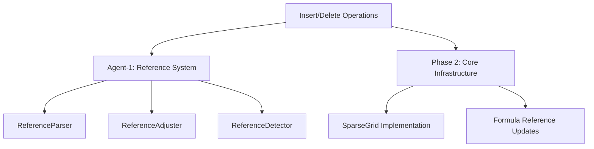

# Blockers Log

## Agent Information
- **Feature**: Insert and Delete Row/Column Operations
- **Agent**: Agent-3
- **Worktree**: /Users/vinay/v/code/gridcore/worktrees/insert-delete

## Active Blockers

## Resolved Blockers

### Blocker #1
- **ID**: BLK-001  
- **Resolved**: 2025-01-04
- **Resolution**: Found Agent-1's reference system implementation on feature/absolute-refs branch. Contains ReferenceParser, ReferenceAdjuster, ReferenceDetector with full types.
- **Time Blocked**: ~1 hour

## Active Blockers

None - Ready to proceed with Phase 2

## Dependency Map

## Notes
- Agent-1's reference system found on feature/absolute-refs branch
- All required classes available: ReferenceParser, ReferenceAdjuster, ReferenceDetector
- Ready to proceed with Phase 2 implementation