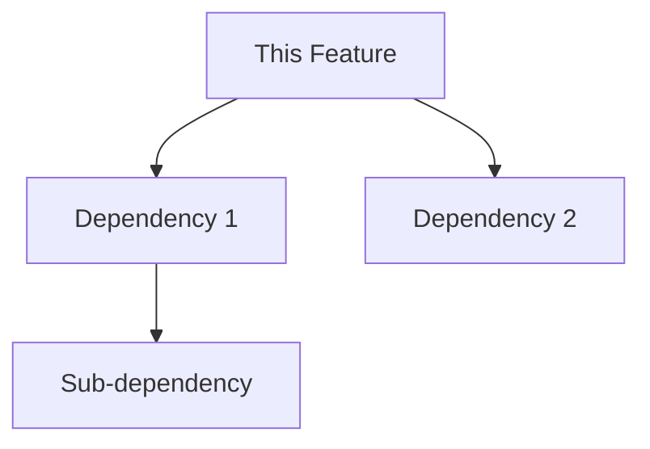

# Blockers Log

## Agent Information
- **Feature**: [Feature Name]
- **Agent**: [Agent Name/ID]
- **Worktree**: [Worktree Path]

## Active Blockers

### Blocker #1
- **ID**: BLK-001
- **Severity**: [Critical | High | Medium | Low]
- **Type**: [Dependency | Technical | Resource | Design]
- **Status**: [Active | Resolved]
- **Created**: [Date/Time]
- **Description**: [Detailed description of the blocker]
- **Impact**: [What work is blocked]
- **Dependencies**: 
  - Waiting on: [Agent/Feature]
  - Specific requirement: [What is needed]
- **Proposed Solution**: [How to resolve]
- **ETA**: [Expected resolution time]

### Blocker #2
- **ID**: BLK-002
- **Severity**: [Critical | High | Medium | Low]
- **Type**: [Dependency | Technical | Resource | Design]
- **Status**: [Active | Resolved]
- **Created**: [Date/Time]
- **Description**: [Detailed description]
- **Impact**: [What work is blocked]
- **Dependencies**: 
  - Waiting on: [Agent/Feature]
  - Specific requirement: [What is needed]
- **Proposed Solution**: [How to resolve]
- **ETA**: [Expected resolution time]

## Resolved Blockers

### Blocker #X
- **ID**: BLK-00X
- **Resolved**: [Date/Time]
- **Resolution**: [How it was resolved]
- **Time Blocked**: [Duration]

## Dependency Map

## Communication Log

### [Date/Time]
- **To**: [Other Agent/Overseer]
- **Subject**: [Blocker ID or topic]
- **Message**: [Communication details]
- **Response**: [Any response received]

## Escalation Path

1. **Level 1**: Direct communication with dependent agent
2. **Level 2**: Notify overseer via BLOCKERS.md update
3. **Level 3**: Request architecture decision or scope change

## Notes
[Any additional context about blockers or dependencies]