# Complete Migration Plan: UIStateMachine to Type-Safe Reducer Pattern

## Architecture Overview
Transform the current string-based state machine into a **fully type-safe** reducer pattern with compile-time validation of all state transitions, eliminating runtime type checking and backward compatibility requirements.

## State Machine Diagram

```mermaid
stateDiagram-v2
    [*] --> Navigation: Initial State
    
    Navigation --> Editing: START_EDITING
    Navigation --> Command: ENTER_COMMAND_MODE
    Navigation --> Visual: ENTER_SPREADSHEET_VISUAL_MODE
    Navigation --> Resize: ENTER_RESIZE_MODE
    Navigation --> Insert: ENTER_STRUCTURAL_INSERT_MODE
    Navigation --> Delete: ENTER_DELETE_MODE
    
    Editing --> Navigation: EXIT_TO_NAVIGATION
    Editing --> EditingNormal: cellMode=normal
    Editing --> EditingInsert: cellMode=insert
    Editing --> EditingVisual: cellMode=visual
    
    EditingNormal --> EditingInsert: ENTER_INSERT_MODE
    EditingNormal --> EditingVisual: ENTER_VISUAL_MODE
    EditingInsert --> EditingNormal: EXIT_INSERT_MODE
    EditingVisual --> EditingNormal: EXIT_VISUAL_MODE
    
    Command --> Navigation: EXIT_COMMAND_MODE
    Command --> BulkOperation: START_BULK_OPERATION
    
    Visual --> Navigation: EXIT_SPREADSHEET_VISUAL_MODE
    
    Resize --> Navigation: EXIT_RESIZE_MODE
    
    Insert --> Navigation: EXIT_STRUCTURAL_INSERT_MODE
    
    Delete --> Navigation: EXIT_DELETE_MODE / CANCEL_DELETE
    Delete --> Navigation: CONFIRM_DELETE [execute]
    
    BulkOperation --> Navigation: COMPLETE_BULK_OPERATION
    BulkOperation --> Navigation: CANCEL_BULK_OPERATION
    
    state Editing {
        [*] --> EditingNormal
        EditingNormal: Normal Mode
        EditingInsert: Insert Mode (i/a/A/I/o/O)
        EditingVisual: Visual Mode (char/line/block)
    }
    
    state Visual {
        [*] --> VisualChar
        VisualChar: Character Selection
        VisualLine: Line Selection  
        VisualBlock: Block Selection
        VisualColumn: Column Selection
        VisualRow: Row Selection
    }
    
    note right of Navigation
        Universal Actions (any state):
        - ESCAPE: Return to parent/navigation
        - UPDATE_CURSOR: Move cursor
        - UPDATE_VIEWPORT: Scroll view
    end note
    
    note right of Command
        Command Mode Actions:
        - UPDATE_COMMAND_VALUE
        - Execute commands on Enter
        - Tab completion
    end note
    
    note right of Resize
        Resize Mode Actions:
        - UPDATE_RESIZE_SIZE
        - Auto-fit
        - Move to prev/next target
    end note
```



## State Transition Matrix

| From State | Action | To State | Conditions |
|------------|--------|----------|------------|
| Navigation | START_EDITING | Editing | With optional editMode |
| Navigation | ENTER_COMMAND_MODE | Command | - |
| Navigation | ENTER_SPREADSHEET_VISUAL_MODE | Visual | With visualMode and selection |
| Navigation | ENTER_RESIZE_MODE | Resize | With target, index, size |
| Navigation | ENTER_STRUCTURAL_INSERT_MODE | Insert | With insertType, position |
| Navigation | ENTER_DELETE_MODE | Delete | With deleteType, selection |
| Editing | EXIT_TO_NAVIGATION | Navigation | - |
| Editing.Normal | ENTER_INSERT_MODE | Editing.Insert | With mode variant |
| Editing.Normal | ENTER_VISUAL_MODE | Editing.Visual | With visualType |
| Editing.Insert | EXIT_INSERT_MODE | Editing.Normal | - |
| Editing.Visual | EXIT_VISUAL_MODE | Editing.Normal | - |
| Command | EXIT_COMMAND_MODE | Navigation | - |
| Command | START_BULK_OPERATION | BulkOperation | With command |
| Visual | EXIT_SPREADSHEET_VISUAL_MODE | Navigation | Preserves selection |
| Visual | UPDATE_SELECTION | Visual | Updates selection |
| Resize | EXIT_RESIZE_MODE | Navigation | - |
| Insert | EXIT_STRUCTURAL_INSERT_MODE | Navigation | - |
| Delete | EXIT_DELETE_MODE | Navigation | - |
| Delete | CONFIRM_DELETE | Navigation | After execution |
| Delete | CANCEL_DELETE | Navigation | - |
| BulkOperation | COMPLETE_BULK_OPERATION | Navigation | - |
| BulkOperation | CANCEL_BULK_OPERATION | Navigation | - |
| Any | ESCAPE | Parent/Navigation | Context-dependent |
| Any | UPDATE_CURSOR | Same | Updates cursor |
| Any | UPDATE_VIEWPORT | Same | Updates viewport |

## Type-Safe Architecture

### 1. State-Specific Action Types
```typescript
// actions/types.ts
// Each state has its own set of valid actions
type NavigationActions = 
  | { type: 'START_EDITING'; editMode?: InsertMode; initialValue?: string }
  | { type: 'ENTER_COMMAND_MODE' }
  | { type: 'ENTER_SPREADSHEET_VISUAL_MODE'; visualMode: SpreadsheetVisualMode; selection: Selection }
  | { type: 'ENTER_RESIZE_MODE'; target: 'column' | 'row'; index: number; size: number };

type EditingActions =
  | { type: 'EXIT_TO_NAVIGATION' }
  | { type: 'ENTER_INSERT_MODE'; mode: InsertMode }
  | { type: 'EXIT_INSERT_MODE' }
  | { type: 'ENTER_VISUAL_MODE'; visualType: VisualMode; anchor?: number }
  | { type: 'EXIT_VISUAL_MODE' }
  | { type: 'UPDATE_EDITING_VALUE'; value: string; cursorPosition: number };

type CommandActions =
  | { type: 'EXIT_COMMAND_MODE' }
  | { type: 'UPDATE_COMMAND_VALUE'; value: string }
  | { type: 'START_BULK_OPERATION'; command: ParsedBulkCommand };

type VisualActions =
  | { type: 'EXIT_SPREADSHEET_VISUAL_MODE' }
  | { type: 'UPDATE_SELECTION'; selection: Selection };

// Universal actions that work in any state
type UniversalActions =
  | { type: 'ESCAPE' }
  | { type: 'UPDATE_CURSOR'; cursor: CellAddress }
  | { type: 'UPDATE_VIEWPORT'; viewport: ViewportInfo };

// Complete action union
type Action = NavigationActions | EditingActions | CommandActions | VisualActions | UniversalActions;
```

### 2. Type-Safe State Store
```typescript
// UIStateStore.ts
export class UIStateStore {
  private state: UIState;
  private listeners: Set<StateListener> = new Set();
  
  constructor(initialState?: UIState) {
    this.state = initialState || createDefaultState();
  }
  
  dispatch(action: Action): Result<UIState> {
    const prevState = this.state;
    const newState = rootReducer(prevState, action);
    
    if (newState === prevState) {
      return err(`Invalid transition: ${action.type} from ${prevState.spreadsheetMode}`);
    }
    
    this.state = newState;
    this.notifyListeners(action);
    return ok(newState);
  }
  
  getState(): Readonly<UIState> {
    return this.state;
  }
  
  subscribe(listener: StateListener): () => void {
    this.listeners.add(listener);
    return () => this.listeners.delete(listener);
  }
}
```

### 3. Type-Safe Reducer Implementation
```typescript
// reducers/index.ts
export const rootReducer = (state: UIState, action: Action): UIState => {
  // Handle universal actions first (work in any state)
  const universalResult = universalReducer(state, action);
  if (universalResult !== state) return universalResult;
  
  // Dispatch to state-specific reducer based on discriminated union
  switch (state.spreadsheetMode) {
    case 'navigation':
      return navigationReducer(
        state as Extract<UIState, { spreadsheetMode: 'navigation' }>,
        action
      );
    
    case 'editing':
      return editingReducer(
        state as Extract<UIState, { spreadsheetMode: 'editing' }>,
        action
      );
    
    case 'command':
      return commandReducer(
        state as Extract<UIState, { spreadsheetMode: 'command' }>,
        action
      );
    
    case 'visual':
      return visualReducer(
        state as Extract<UIState, { spreadsheetMode: 'visual' }>,
        action
      );
    
    case 'resize':
      return resizeReducer(
        state as Extract<UIState, { spreadsheetMode: 'resize' }>,
        action
      );
    
    case 'bulkOperation':
      return bulkReducer(
        state as Extract<UIState, { spreadsheetMode: 'bulkOperation' }>,
        action
      );
    
    // TypeScript ensures exhaustiveness - won't compile if we miss a case
    default:
      const _exhaustive: never = state;
      return state;
  }
};
```

### 4. Type-Safe Individual Reducers
```typescript
// reducers/navigation.ts
type NavigationState = Extract<UIState, { spreadsheetMode: 'navigation' }>;

export const navigationReducer = (
  state: NavigationState,
  action: Action
): UIState => {
  // TypeScript knows state is NavigationState here
  // Only handle actions valid for navigation mode
  if (!isNavigationAction(action)) return state;
  
  switch (action.type) {
    case 'START_EDITING': {
      const cellMode: CellMode = action.editMode ? "insert" : "normal";
      return {
        spreadsheetMode: 'editing',
        cursor: state.cursor,
        viewport: state.viewport,
        cellMode,
        editingValue: action.initialValue ?? "",
        cursorPosition: action.cursorPosition ?? 0,
        editVariant: action.editMode,
      };
    }
    
    case 'ENTER_COMMAND_MODE':
      return {
        spreadsheetMode: 'command',
        cursor: state.cursor,
        viewport: state.viewport,
        commandValue: ":",
      };
      
    case 'ENTER_SPREADSHEET_VISUAL_MODE':
      return {
        spreadsheetMode: 'visual',
        cursor: state.cursor,
        viewport: state.viewport,
        visualMode: action.visualMode,
        anchor: state.cursor,
        selection: action.selection,
      };
      
    // TypeScript prevents handling invalid actions like EXIT_TO_NAVIGATION
    default:
      const _exhaustive: never = action;
      return state;
  }
};

// Type guard for navigation actions
function isNavigationAction(action: Action): action is NavigationActions {
  return ['START_EDITING', 'ENTER_COMMAND_MODE', 'ENTER_SPREADSHEET_VISUAL_MODE', 'ENTER_RESIZE_MODE'].includes(action.type);
}
```

### 5. Type-Safe Nested State Handling
```typescript
// reducers/editing.ts
type EditingState = Extract<UIState, { spreadsheetMode: 'editing' }>;

export const editingReducer = (
  state: EditingState,
  action: Action
): UIState => {
  // Handle universal editing actions
  switch (action.type) {
    case 'EXIT_TO_NAVIGATION':
      return {
        spreadsheetMode: 'navigation',
        cursor: state.cursor,
        viewport: state.viewport,
      };
      
    case 'UPDATE_EDITING_VALUE':
      return {
        ...state,
        editingValue: action.value,
        cursorPosition: action.cursorPosition,
      };
  }
  
  // Dispatch to cell mode specific handlers
  switch (state.cellMode) {
    case 'normal':
      return normalModeReducer(state, action);
    case 'insert':
      return insertModeReducer(state, action);
    case 'visual':
      return visualModeReducer(state, action);
    default:
      const _exhaustive: never = state.cellMode;
      return state;
  }
};

const normalModeReducer = (
  state: EditingState & { cellMode: 'normal' },
  action: Action
): UIState => {
  if (action.type === 'ENTER_INSERT_MODE') {
    return {
      ...state,
      cellMode: 'insert',
      editVariant: action.mode,
    };
  }
  
  if (action.type === 'ENTER_VISUAL_MODE') {
    return {
      ...state,
      cellMode: 'visual',
      visualType: action.visualType,
      visualStart: action.anchor ?? state.cursorPosition,
    };
  }
  
  return state;
};
```

## Migration Steps

### Phase 1: Create New Reducer System
1. **Create reducer files:**
   - `reducers/index.ts` - Root reducer
   - `reducers/navigation.ts` - Navigation mode transitions
   - `reducers/editing.ts` - Editing mode (with nested cell modes)
   - `reducers/command.ts` - Command mode transitions
   - `reducers/visual.ts` - Visual mode transitions
   - `reducers/resize.ts` - Resize mode transitions
   - `reducers/structural.ts` - Insert/delete operations
   - `reducers/bulk.ts` - Bulk operations
   - `reducers/universal.ts` - Cross-mode actions (cursor, viewport, escape)

2. **Create UIStateStore class:**
   - Replace UIStateMachine class entirely
   - Use same public API (dispatch, getState, subscribe)
   - No transition map, just reducer composition

### Phase 2: Update SpreadsheetController
1. **Replace stateMachine with stateStore:**
   ```typescript
   // Before
   private stateMachine: UIStateMachine;
   this.stateMachine = new UIStateMachine(initialState);
   
   // After
   private stateStore: UIStateStore;
   this.stateStore = new UIStateStore(initialState);
   ```

2. **Update all transition calls:**
   ```typescript
   // Before
   this.stateMachine.transition({ type: "START_EDITING" });
   
   // After (same API, different implementation)
   this.stateStore.dispatch({ type: "START_EDITING" });
   ```

### Phase 3: Update Dependencies
1. **Update type exports in index.ts:**
   - Export UIStateStore instead of UIStateMachine
   - Keep Action types unchanged
   - Keep UIState types unchanged

2. **Update consumers:**
   - SpreadsheetController tests
   - StateVisualizer 
   - Documentation generation scripts

### Phase 4: Remove Old Code
1. Delete `UIStateMachine.ts`
2. Remove transition handler methods
3. Clean up unused imports

## Key Benefits of This Approach

1. **Pure Functions:** All reducers are pure, making testing trivial
2. **No String Keys:** Direct action type matching in switch statements
3. **Better Type Safety:** TypeScript can verify exhaustiveness
4. **Simpler Nested States:** Handle directly in editing reducer
5. **Easier Debugging:** Can log every action and state change
6. **Performance:** No string manipulation or map lookups

## Testing Strategy

1. **Unit test each reducer:**
   ```typescript
   test('navigationReducer handles START_EDITING', () => {
     const state = createNavigationState(cursor, viewport);
     const newState = navigationReducer(state, { type: 'START_EDITING' });
     expect(isEditingMode(newState)).toBe(true);
   });
   ```

2. **Integration test the root reducer:**
   - Test cross-mode transitions
   - Test invalid transitions return unchanged state
   - Test universal actions work in all modes

3. **E2E test through SpreadsheetController:**
   - Existing tests should pass unchanged
   - API remains the same

## Implementation Order

### Day 1: Core Infrastructure
- Create UIStateStore class
- Create root reducer and universal reducer
- Set up reducer composition pattern

### Day 2: Mode Reducers
- Implement navigation reducer
- Implement editing reducer (with nested modes)
- Implement command reducer
- Implement visual reducer

### Day 3: Specialized Reducers
- Implement resize reducer
- Implement structural operations reducer
- Implement bulk operations reducer

### Day 4: Integration
- Update SpreadsheetController
- Update all tests
- Remove old UIStateMachine

### Day 5: Cleanup
- Update documentation
- Update type exports
- Final testing and verification

## Breaking Changes (No Backward Compatibility)

1. **UIStateMachine class removed** - Replaced by UIStateStore
2. **transition() method renamed** - Now dispatch()
3. **No transition history** - Can be added to Store if needed
4. **No string-based transition keys** - Direct action matching

## File Structure After Migration
```
packages/ui-core/src/
├── state/
│   ├── UIState.ts (unchanged)
│   ├── UIStateStore.ts (new)
│   └── reducers/
│       ├── index.ts
│       ├── navigation.ts
│       ├── editing.ts
│       ├── command.ts
│       ├── visual.ts
│       ├── resize.ts
│       ├── structural.ts
│       ├── bulk.ts
│       └── universal.ts
```

## Detailed Reducer Implementations

### Navigation Reducer
```typescript
export const navigationReducer: StateReducer = (state, action) => {
  if (!isNavigationMode(state)) return state;
  
  switch (action.type) {
    case 'START_EDITING': {
      const cellMode: CellMode = action.editMode ? "insert" : "normal";
      const newState = createEditingState(state.cursor, state.viewport, cellMode);
      
      if (action.editMode && isEditingMode(newState)) {
        return {
          ...newState,
          editVariant: action.editMode,
          editingValue: action.initialValue ?? "",
          cursorPosition: action.cursorPosition ?? 0,
        };
      }
      return newState;
    }
    
    case 'ENTER_COMMAND_MODE':
      return createCommandState(state.cursor, state.viewport);
      
    case 'ENTER_SPREADSHEET_VISUAL_MODE':
      return createSpreadsheetVisualState(
        state.cursor,
        state.viewport,
        action.visualMode,
        state.cursor,
        action.selection
      );
      
    case 'ENTER_RESIZE_MODE':
      return createResizeState(
        state.cursor,
        state.viewport,
        action.target,
        action.index,
        action.size
      );
      
    default:
      return state;
  }
};
```

### Editing Reducer (with nested modes)
```typescript
export const editingReducer: StateReducer = (state, action) => {
  if (!isEditingMode(state)) return state;
  
  // Handle cell mode transitions first
  switch (state.cellMode) {
    case 'normal':
      return normalModeReducer(state, action);
    case 'insert':
      return insertModeReducer(state, action);
    case 'visual':
      return visualModeReducer(state, action);
  }
  
  // Handle actions that work in any cell mode
  switch (action.type) {
    case 'EXIT_TO_NAVIGATION':
      return createNavigationState(state.cursor, state.viewport);
      
    case 'UPDATE_EDITING_VALUE':
      return {
        ...state,
        editingValue: action.value,
        cursorPosition: action.cursorPosition,
      };
      
    default:
      return state;
  }
};

const normalModeReducer: StateReducer = (state, action) => {
  switch (action.type) {
    case 'ENTER_INSERT_MODE':
      return {
        ...state,
        cellMode: 'insert',
        editVariant: action.mode,
      };
      
    case 'ENTER_VISUAL_MODE':
      return {
        ...state,
        cellMode: 'visual',
        visualType: action.visualType,
        visualStart: action.anchor ?? state.cursorPosition,
      };
      
    default:
      return state;
  }
};
```

### Universal Reducer (handles ESCAPE, cursor updates, etc.)
```typescript
export const universalReducer: StateReducer = (state, action) => {
  switch (action.type) {
    case 'ESCAPE':
      return handleEscape(state);
      
    case 'UPDATE_CURSOR':
      return {
        ...state,
        cursor: action.cursor,
      };
      
    case 'UPDATE_VIEWPORT':
      return {
        ...state,
        viewport: action.viewport,
      };
      
    default:
      return state;
  }
};

const handleEscape = (state: UIState): UIState => {
  if (isEditingMode(state)) {
    if (state.cellMode === 'insert' || state.cellMode === 'visual') {
      // Exit to normal mode within editing
      return {
        ...state,
        cellMode: 'normal',
        visualType: undefined,
        visualStart: undefined,
        editVariant: undefined,
      };
    }
    // Exit editing mode entirely
    return createNavigationState(state.cursor, state.viewport);
  }
  
  if (isSpreadsheetVisualMode(state)) {
    return createNavigationState(state.cursor, state.viewport, state.selection);
  }
  
  if (isCommandMode(state) || isResizeMode(state)) {
    return createNavigationState(state.cursor, state.viewport);
  }
  
  // Already in navigation, nothing to do
  return state;
};
```

This migration completely replaces the state machine with a cleaner, more maintainable reducer pattern while keeping the external API similar enough that consumers only need minimal updates.