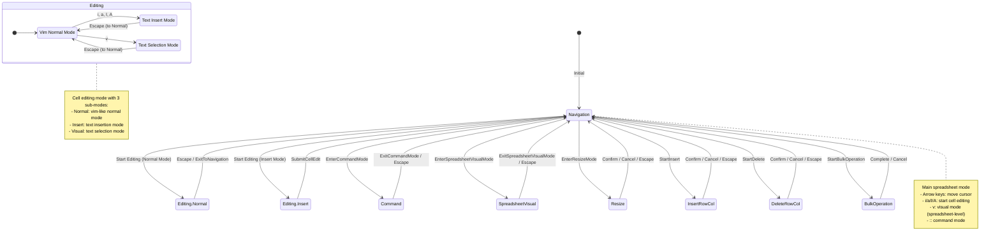
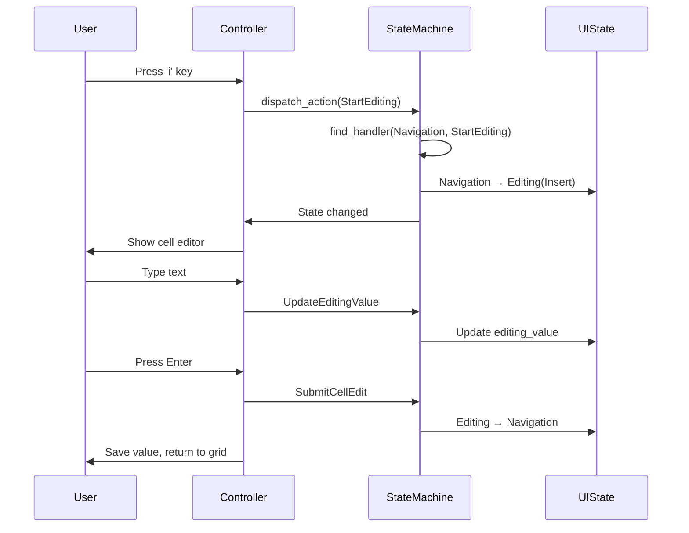

# GridCore State Machine (Moore Machine)

This document describes the state machine that governs the interaction between spreadsheet navigation and cell editing modes in GridCore.

## State Machine Diagram

## States

### Primary States

1. **Navigation** (`UIState::Navigation`)

   - Default spreadsheet navigation mode
   - Cursor movement between cells
   - Entry point to all other modes
   - Contains: cursor, viewport, selection

1. **Editing** (`UIState::Editing`)

   - Cell content editing mode
   - Has three sub-modes (CellMode):
     - **Normal**: Vim-like normal mode for cell editing
     - **Insert**: Active text insertion
     - **Visual**: Text selection within cell
   - Contains: cursor, viewport, cell_mode, editing_value, cursor_position, edit_variant

1. **Command** (`UIState::Command`)

   - Command line mode (triggered by ':')
   - For executing spreadsheet commands
   - Contains: cursor, viewport, command_value

1. **Visual** (`UIState::Visual`)

   - Spreadsheet-level visual selection mode
   - For selecting ranges of cells
   - Contains: cursor, viewport, selection, visual_mode, anchor

1. **Resize** (`UIState::Resize`)

   - Column/row resizing mode
   - Interactive size adjustment
   - Contains: resize_target, current_size, original_size

1. **Insert** (`UIState::Insert`)

   - Structural insert mode (rows/columns)
   - Not for text editing
   - Contains: insert_type, position, count

1. **Delete** (`UIState::Delete`)

   - Structural delete mode (rows/columns)
   - Confirmation pending state
   - Contains: delete_type, targets, confirmation_pending

1. **BulkOperation** (`UIState::BulkOperation`)

   - Bulk operations on cell ranges
   - Find/replace, transformations
   - Contains: parsed_command, affected_cells, status

## Key Transitions

### Navigation → Editing Transitions

| Trigger Key | Action                                                                     | Target State    | Notes                 |
| ----------- | -------------------------------------------------------------------------- | --------------- | --------------------- |
| `i`         | `StartEditing {edit_mode: Some(InsertMode::I)}`                            | Editing(Insert) | Insert at cursor      |
| `a`         | `StartEditing {edit_mode: Some(InsertMode::A)}`                            | Editing(Insert) | Append after cursor   |
| `I`         | `StartEditing {edit_mode: Some(InsertMode::CapitalI)}`                     | Editing(Insert) | Insert at line start  |
| `A`         | `StartEditing {edit_mode: Some(InsertMode::CapitalA)}`                     | Editing(Insert) | Append at line end    |
| `Enter`     | `StartEditing {edit_mode: Some(InsertMode::I), initial_value: Some("")}`   | Editing(Insert) | Clear and edit        |
| Any char    | `StartEditing {edit_mode: Some(InsertMode::I), initial_value: Some(char)}` | Editing(Insert) | Start with typed char |

### Editing → Navigation Transitions

| State           | Trigger  | Action             | Result                   |
| --------------- | -------- | ------------------ | ------------------------ |
| Editing(Insert) | `Escape` | `Escape`           | Editing(Normal)          |
| Editing(Normal) | `Escape` | `Escape`           | Navigation               |
| Editing(Insert) | `Enter`  | `SubmitCellEdit`   | Navigation (+ move down) |
| Any             |          | `ExitToNavigation` | Navigation               |

### Escape Key Behavior (Universal Handler)

The Escape key behavior is context-sensitive:

1. **In Editing mode:**

   - From Insert/Visual sub-mode → Normal sub-mode
   - From Normal sub-mode → Navigation

1. **In other modes:**

   - Command → Navigation
   - Visual → Navigation
   - Resize → Navigation
   - Insert/Delete → Navigation (cancel operation)

1. **In Navigation:**

   - No effect (already at top level)

## Implementation Details

### Handler Registry

The state machine uses a handler registry pattern with specialized handlers:

1. `NavigationHandler` - Handles transitions from Navigation state
1. `EditingHandler` - Handles transitions within Editing state
1. `VisualHandler` - Handles Visual mode transitions
1. `CommandHandler` - Handles Command mode transitions
1. `ResizeHandler` - Handles Resize mode transitions
1. `StructuralHandler` - Handles Insert/Delete operations
1. `BulkHandler` - Handles bulk operations
1. `UniversalHandler` - Handles universal actions (Escape, UpdateCursor, etc.)

### State Machine Properties

- **Moore Machine**: Output (UI state) depends only on current state
- **Deterministic**: Each state/action pair has at most one valid transition
- **History Tracking**: Maintains transition history with diffs for undo/redo
- **Event-Driven**: Actions trigger state transitions
- **Listener Pattern**: State changes notify registered listeners

## Cell Editing Flow

## Formula Bar Integration

The formula bar is synchronized with the state machine:

1. **Navigation mode**: Shows current cell's value/formula
1. **Editing mode**: Shows editing_value from state
1. **Updates**: `UpdateFormulaBar` action updates controller's formula_bar_value
1. **Submit**: `SubmitFormulaBar` sets cell value without entering edit mode

## Design Rationale

1. **Vim-inspired**: Modal editing provides power users with efficient navigation
1. **Nested modes**: Cell editing has its own sub-modes for fine control
1. **Escape consistency**: Always moves "up" the mode hierarchy
1. **State isolation**: Each state contains only relevant data
1. **Action atomicity**: Each action represents a single user intent

