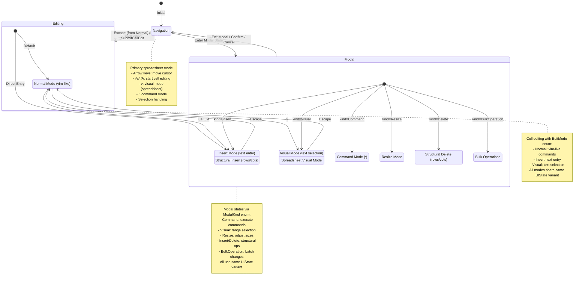
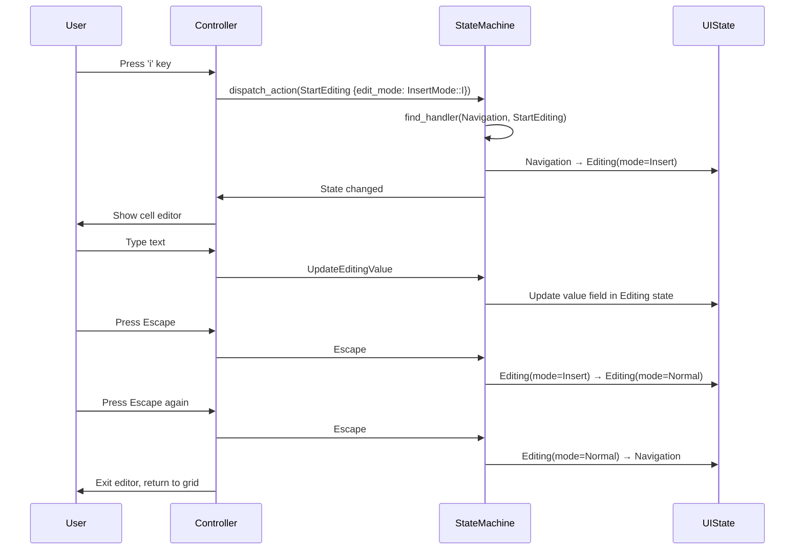

# GridCore State Machine (Moore Machine)

This document describes the state machine that governs the interaction between spreadsheet navigation and cell editing modes in GridCore.

## Simplified Architecture (3-Variant UIState)

As of the latest refactoring, GridCore uses a simplified state architecture with only **3 core UIState variants**:

1. **Navigation** - Primary spreadsheet navigation
2. **Editing** - Cell content editing with sub-modes
3. **Modal** - All other modal states (Command, Visual, Resize, etc.)

This simplification reduces complexity while maintaining full functionality through the use of `EditMode` enum for cell editing sub-modes and `ModalKind` enum for different modal types.

## State Machine Diagram



## States

### Core UIState Variants (3 Total)

1. **Navigation** (`UIState::Navigation`)
   - Default spreadsheet navigation mode
   - Cursor movement between cells
   - Entry point to all other modes
   - Fields:
     - `cursor`: Current cell position (CellAddress)
     - `viewport`: Visible area (ViewportInfo)
     - `selection`: Optional cell/range selection

2. **Editing** (`UIState::Editing`)
   - Cell content editing mode
   - Contains internal mode switching via `EditMode` enum
   - Fields:
     - `cursor`: Current cell position (CellAddress)
     - `viewport`: Visible area (ViewportInfo)
     - `value`: Current editing value (String)
     - `cursor_pos`: Text cursor position (usize)
     - `mode`: Current edit mode (EditMode)
     - `visual_start`: Start position for visual selection (Option<usize>)
     - `visual_type`: Type of visual selection (Option<VisualMode>)
     - `insert_variant`: Specific insert mode variant (Option<InsertMode>)

3. **Modal** (`UIState::Modal`)
   - Container for all modal states
   - Modal type determined by `kind` field
   - Fields:
     - `cursor`: Current cell position (CellAddress)
     - `viewport`: Visible area (ViewportInfo)
     - `kind`: Type of modal (ModalKind enum)
     - `data`: Modal-specific data (ModalData enum)

### EditMode Enum (Cell Editing Sub-modes)

```rust
enum EditMode {
    Normal,  // Vim-like normal mode
    Insert,  // Text insertion mode
    Visual,  // Text selection mode
}
```

### ModalKind Enum (Modal Types)

```rust
enum ModalKind {
    Command,        // Command line mode (:)
    Visual,         // Spreadsheet visual selection
    Resize,         // Column/row resizing
    Insert,         // Structural insert (rows/columns)
    Delete,         // Structural delete (rows/columns)
    BulkOperation,  // Bulk operations on ranges
}
```

### ModalData Variants

Each modal type has associated data stored in the `ModalData` enum:

1. **Command**: `value: String` - Command text being entered
2. **Visual**: 
   - `selection: Selection` - Current selection
   - `visual_mode: VisualMode` - Type of selection (Character/Line/Block/Row/Column)
   - `anchor: CellAddress` - Selection anchor point
3. **Resize**:
   - `target: ResizeTarget` - What's being resized
   - `sizes: ResizeSizes` - Size tracking information
4. **Insert**:
   - `insert_type: InsertType` - Row or Column
   - `position: InsertPosition` - Before or After
   - `reference: u32` - Reference index
   - `count: u32` - Number to insert
5. **Delete**:
   - `delete_type: DeleteType` - Row or Column
   - `targets: Vec<u32>` - Indices to delete
   - `confirmation_pending: bool` - Awaiting confirmation
6. **BulkOperation**:
   - `parsed_command: ParsedBulkCommand` - Operation details
   - `affected_cells: u32` - Count of affected cells
   - `status: BulkOperationStatus` - Current status

## Key Transitions

### Navigation → Editing Transitions

| Trigger Key | Action                                                                     | Target State              | Notes                 |
| ----------- | -------------------------------------------------------------------------- | ------------------------- | --------------------- |
| `i`         | `StartEditing {edit_mode: Some(InsertMode::I)}`                          | Editing(mode=Insert)      | Insert at cursor      |
| `a`         | `StartEditing {edit_mode: Some(InsertMode::A)}`                          | Editing(mode=Insert)      | Append after cursor   |
| `I`         | `StartEditing {edit_mode: Some(InsertMode::CapitalI)}`                   | Editing(mode=Insert)      | Insert at line start  |
| `A`         | `StartEditing {edit_mode: Some(InsertMode::CapitalA)}`                   | Editing(mode=Insert)      | Append at line end    |
| `Enter`     | `StartEditing {edit_mode: Some(InsertMode::I), initial_value: Some("")}` | Editing(mode=Insert)      | Clear and edit        |
| Any char    | `StartEditing {edit_mode: Some(InsertMode::I), initial_value: Some(char)}`| Editing(mode=Insert)     | Start with typed char |

### Navigation → Modal Transitions

| Trigger Key | Action                          | Target State                      | Notes                      |
| ----------- | ------------------------------- | --------------------------------- | -------------------------- |
| `:`         | `EnterCommandMode`              | Modal(kind=Command)               | Enter command mode         |
| `v`         | `EnterSpreadsheetVisualMode`    | Modal(kind=Visual)                | Range selection mode       |
| Resize UI   | `EnterResizeMode`               | Modal(kind=Resize)                | Column/row resize          |
| Insert Cmd  | `StartInsert`                   | Modal(kind=Insert)                | Insert rows/columns        |
| Delete Cmd  | `StartDelete`                   | Modal(kind=Delete)                | Delete rows/columns        |
| Bulk Cmd    | `StartBulkOperation`            | Modal(kind=BulkOperation)         | Bulk operations            |

### Editing Internal Transitions (EditMode changes)

| Current Mode    | Trigger  | Action                | Target Mode      | Notes                     |
| --------------- | -------- | -------------------- | ---------------- | ------------------------- |
| Insert          | `Escape` | `ExitInsertMode`     | Normal           | Exit to normal mode       |
| Normal          | `i/a/I/A`| `EnterInsertMode`    | Insert           | Enter insert with variant |
| Normal          | `v`      | `EnterVisualMode`    | Visual           | Text selection mode       |
| Visual          | `Escape` | `ExitVisualMode`     | Normal           | Back to normal mode       |

### Exit Transitions (Back to Navigation)

| Source State              | Trigger     | Action                 | Result State | Notes                        |
| ------------------------- | ----------- | ---------------------- | ------------ | ---------------------------- |
| Editing(mode=Normal)      | `Escape`    | `ExitToNavigation`     | Navigation   | Exit cell editing            |
| Editing(mode=Insert)      | `Enter`     | `SubmitCellEdit`       | Navigation   | Save and exit                |
| Modal(kind=Command)       | `Escape`    | `ExitCommandMode`      | Navigation   | Cancel command               |
| Modal(kind=Command)       | `Enter`     | `ExecuteCommand`       | Navigation   | Execute and exit             |
| Modal(kind=Visual)        | `Escape`    | `ExitSpreadsheetVisualMode` | Navigation | Cancel selection        |
| Modal(kind=Resize)        | `Escape`    | `CancelResize`         | Navigation   | Cancel resize                |
| Modal(kind=Resize)        | `Enter`     | `ConfirmResize`        | Navigation   | Apply resize                 |
| Modal(kind=Insert)        | `Escape`    | `CancelInsert`         | Navigation   | Cancel insert                |
| Modal(kind=Insert)        | `Enter`     | `ConfirmInsert`        | Navigation   | Execute insert               |
| Modal(kind=Delete)        | `Escape`    | `CancelDelete`         | Navigation   | Cancel delete                |
| Modal(kind=Delete)        | `Enter`     | `ConfirmDelete`        | Navigation   | Execute delete               |
| Modal(kind=BulkOperation) | `Escape`    | `CancelBulkOperation`  | Navigation   | Cancel operation             |
| Modal(kind=BulkOperation) | `Enter`     | `ExecuteBulkOperation` | Navigation   | Execute operation            |

### Escape Key Behavior (Universal Handler)

The Escape key behavior is context-sensitive:

1. **In Editing state:**
   - From Insert mode → Normal mode (stay in Editing state)
   - From Visual mode → Normal mode (stay in Editing state)
   - From Normal mode → Navigation state

2. **In Modal state:**
   - Any ModalKind → Navigation state (cancels operation)
   - Examples:
     - Modal(kind=Command) → Navigation
     - Modal(kind=Visual) → Navigation
     - Modal(kind=Resize) → Navigation

3. **In Navigation state:**
   - No effect (already at root state)

## Implementation Details

### Handler Registry

The state machine uses a handler registry pattern with specialized handlers:

1. **NavigationHandler** - Handles transitions from Navigation state
   - Starting cell editing (`StartEditing`)
   - Entering modal states (`EnterCommandMode`, `EnterSpreadsheetVisualMode`, etc.)
   - Cursor movement and selection

2. **EditingHandler** - Handles transitions within Editing state
   - Mode switching between Normal/Insert/Visual
   - Text manipulation actions
   - Exit to Navigation

3. **ModalHandlers** - Each modal type has its handler:
   - `CommandHandler` - Command mode operations
   - `VisualHandler` - Spreadsheet visual selection
   - `ResizeHandler` - Column/row resizing
   - `StructuralHandler` - Insert/Delete row/column operations
   - `BulkHandler` - Bulk operations

4. **UniversalHandler** - Handles universal actions
   - Escape key processing (context-aware)
   - Cursor updates
   - Viewport changes

### State Machine Properties

- **Moore Machine**: Output (UI state) depends only on current state
- **Deterministic**: Each state/action pair has at most one valid transition
- **History Tracking**: Maintains transition history with diffs for undo/redo
- **Event-Driven**: Actions trigger state transitions
- **Listener Pattern**: State changes notify registered listeners
- **Type Safety**: Rust's enum system ensures exhaustive state handling

### Helper Functions

The implementation provides type guard functions for state checking:

```rust
// Core state checks
is_navigation_mode(&UIState) -> bool
is_editing_mode(&UIState) -> bool

// Modal state checks
is_command_mode(&UIState) -> bool  // Checks Modal(kind=Command)
is_visual_mode(&UIState) -> bool   // Checks Modal(kind=Visual)
is_resize_mode(&UIState) -> bool   // Checks Modal(kind=Resize)
is_bulk_operation_mode(&UIState) -> bool
```

### Factory Functions

Convenient state creation functions:

```rust
create_navigation_state(cursor, viewport, selection) -> UIState
create_editing_state(cursor, viewport, mode) -> UIState
create_command_state(cursor, viewport) -> UIState
create_visual_state(cursor, viewport, visual_mode, anchor, selection) -> UIState
```

### SpreadsheetMode Derivation

The `SpreadsheetMode` enum is derived from UIState, not stored:

```rust
impl UIState {
    pub fn spreadsheet_mode(&self) -> SpreadsheetMode {
        match self {
            UIState::Navigation { .. } => SpreadsheetMode::Navigation,
            UIState::Editing { mode, .. } => match mode {
                EditMode::Insert => SpreadsheetMode::Insert,
                EditMode::Normal => SpreadsheetMode::Editing,
                EditMode::Visual => SpreadsheetMode::Visual,
            },
            UIState::Modal { kind, .. } => match kind {
                ModalKind::Command => SpreadsheetMode::Command,
                ModalKind::Visual => SpreadsheetMode::Visual,
                // ... etc
            }
        }
    }
}
```

## Cell Editing Flow



## Formula Bar Integration

The formula bar is synchronized with the state machine:

1. **Navigation state**: Shows current cell's value/formula
2. **Editing state**: Shows `value` field from Editing state
3. **Modal states**: Formula bar behavior varies by modal type:
   - Command mode: Formula bar may be hidden or show command
   - Visual mode: Shows selection information
   - Other modals: Context-dependent display
4. **Updates**: `UpdateFormulaBar` action updates controller's formula_bar_value
5. **Submit**: `SubmitFormulaBar` sets cell value without entering edit mode

## Design Rationale

### Why 3 Core States?

The simplified 3-variant UIState architecture provides several benefits:

1. **Reduced Complexity**: Instead of 8+ separate state types, we have just 3 core variants
2. **Cleaner Type System**: Fewer match arms in Rust code, easier exhaustive matching
3. **Flexible Modals**: New modal types can be added via ModalKind enum without changing UIState
4. **Consistent Structure**: All states share cursor and viewport fields

### Design Principles

1. **Vim-inspired**: Modal editing provides power users with efficient navigation
2. **Nested modes**: Cell editing has its own sub-modes (EditMode) for fine control
3. **Escape consistency**: Always moves "up" the mode hierarchy
4. **State isolation**: Each state contains only relevant data
5. **Action atomicity**: Each action represents a single user intent
6. **Type safety**: Rust's enum system prevents invalid state combinations

### State Data Organization

- **Common fields** (cursor, viewport): Present in all 3 states
- **State-specific data**: Stored directly in state variant or in ModalData
- **Derived values**: SpreadsheetMode computed from UIState, not stored
- **Separation of concerns**: EditMode for cell editing, ModalKind for spreadsheet modals

