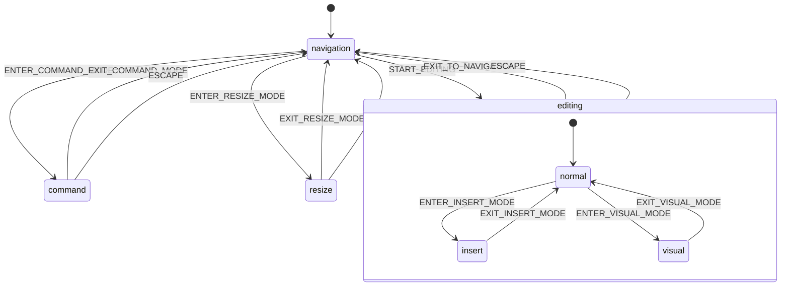

# UI State Machine Diagram

## How to view this diagram

1. Copy the mermaid code above
2. Visit [Mermaid Live Editor](https://mermaid.live)
3. Paste the code to see the diagram
4. Or use any markdown viewer that supports Mermaid diagrams
